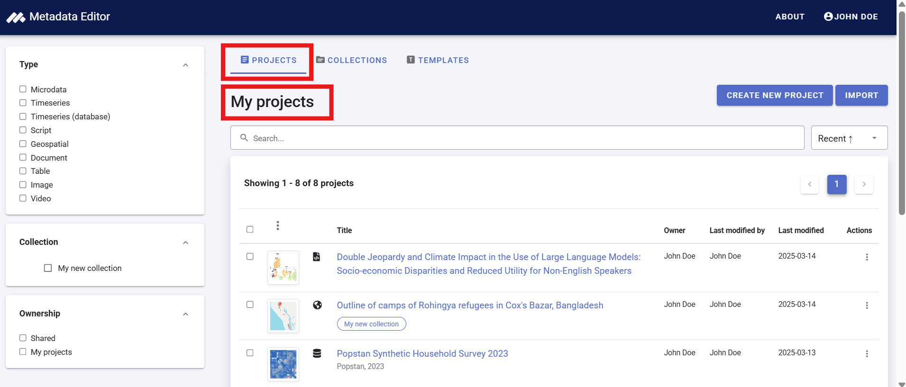
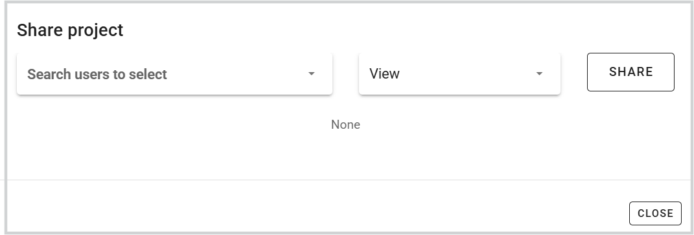
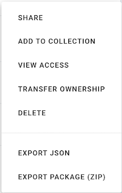
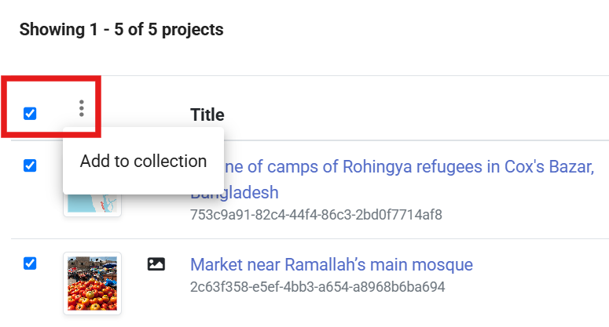
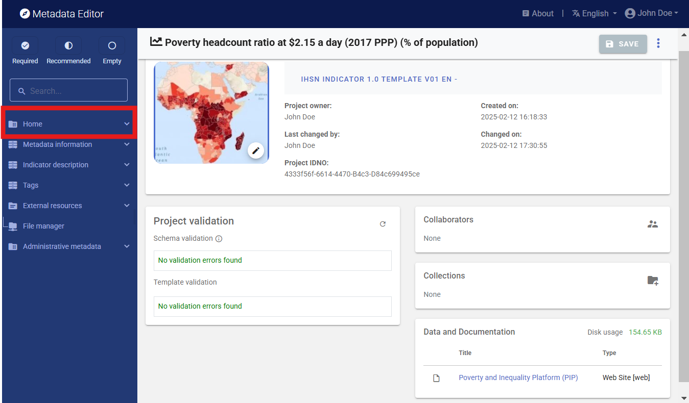

# Managing projects

A **project** in the Metadata Editor represents a "dataset" of any type. This may include:
- A **document** of any type.
- A **microdataset** obtained from a survey, census, sensor, or administrative data recording system.
- An **indicator** or **database** of indicators.
- A vector or raster **geographic dataset** (or a geographic service).
- An **image** or **video**.
- A research project with its associated **scripts**.

## The *My Projects* Page

The *MY PROJECTS* page is the default page of the Metadata Editor, where all projects available to a user are listed. Other main pages include *COLLECTIONS* and *TEMPLATES*, which are accessible only to users with credentials to manage these sections.

All users, regardless of their roles and permissions, can access the *My Projects* page. The content displayed in the page is determined by the user's credentials. Users will will only see the projects they have permission to view or edit (i.e., the project they created or the projects that were shared with them).

The list of projects can be filtered by:
- Type
- Collection (if applicable)
- Ownership (which distinguishes projects you own from projects shared with you by another user); you own a project if you created it, or if its ownership was transferred to you by another user.

You can also **search** for projects using keywords. Note that the search only looks for keywords in the project title, not in the full project metadata.

## Actions on a project

From the *My Projects* page, you can perform the following actions based on your role and permissions:

- **Create a new project.** Click `CREATE NEW PROJECT` and select a data type from the list. A new project page will open with an *Untitled* project. You can start entering content immediately, and the new project will be added to your *My Projects* list. You will be the *owner* of the project you create.

- **Import an existing project.** Click `IMPORT` and specify the project type. Upload a ZIP package generated by the Metadata Editor (a ZIP file that contains all materials related to the project, including the metadata generated using the Metadata Editor). This tool allows you to archive projects, and to share projects with other organizations (sharing projects with other users of the same instance of the Metadata Editor is done using the `SHARE` option, not by exporting/importing packages - see below).

- **Open an existing project.** Click on the project title in the list to open the project page and view or edit its content.

From a specific *Project* page, several actions can be performed by clicking the `Options` button.

  

The available actions include:

- **`SHARE`** Share the project with one or more registered users. You can assign different levels of access: *View*, *Edit*, or *Admin*. Shared projects will then appear on the recipients' *My Projects* page.
    
    

    
  
- **`ADD TO COLLECTION`** Add the project to one or more collections on which you have access permissions. A popup will prompt you to select the collection(s). See the *Managing Collections* section for more details.

- **`VIEW ACCESS`** Display information on project permissions, listing users with View, Edit, or Admin rights, as well as the collections the project belongs to. Permissions cannot be modified from this page. To change permissions for a project you own, open the project and use the *Collaborators* section on the *Project home page*.

- **`TRANSFER OWNERSHIP`** Transfer the ownersip of a project you own to another registered user. You will be given the option to retain some level of access after the transfer.

- **`DELETE`** Delete a project where you have admin rights.

- **`EXPORT JSON`** Generate a JSON file containing the project metadata. You can exclude metadata elements marked as *Private* in the metadata template, and choose whether to include administrative metadata and metadata on external resources.

- **`EXPORT PACKAGE (ZIP)`** Generate a ZIP package with all project materials (data, metadata, and related resources). Use this option for archiving or sharing projects with another organization that can import the package into its own instance of the Metadata Editor.

- **`LOCK & VERSION`** Lock the project to prevent further edits and to assign a version identifier to the metadata. This option will be used when an organization's metadata governance requires a review and approval process. Upon locking, a reviewer assigns a version number to the metadata (following semantic versioning rules) and records relevant version details. Once locked, the metadata cannot be edited, but an editable copy remains available for future modifications and versioning. All locked versions are preserved and listed in the Metadata Editor. A checksum is generated for each locked version of the metadata and stored in the Metadata Editor database.

## Batch actions on projects

You can select multiple projects using the checkboxes next to the project titles and apply batch actions. In the current version of the Metadata Editor, the only available batch action is to add the selected projects to a collection.

## The project home page

Clicking on a project title in the *My Projects* page, or creating a new project, opens the project's *Home* page. If you are already working on a project, you can access the home page by clicking *Home* in the navigation tree.

The project *Home* page contains the following components:

- **Navigation tree.** Displays the metadata structure defined by the selected template for documenting the dataset.

- **Header.** Shows core information, including data type, creation and modification dates, project owner, project identifier (user-defined and system-generated), version, and status.

- **Template selection.** Allows selection of a metadata template and the option to add administrative metadata.

- **Project validation.** Lists violations, if any, of standard requirements (schema validation) and user-defined template rules (template validation).

- **Collaborators.** Lists registered users with access to the project, along with their assigned roles (*View*, *Edit*, *Admin*).

- **Collections.** Shows the collections to which the project belongs, if any.

- **File Management.** Displays files associated with the pmroject and their storage details.

  > Special attention is required to the file management for microdata to ensure compliance with security and access rules. Data files uploaded to the server allow automatic generation of data dictionaries and summary statistics. Sensitive data should be deleted from the server to prevent unauthorized access or storage on unaccredited servers.

For more information about the available options in the project *Home* page and other project pages, refer to the section *Documenting Data – General Instructions*.
